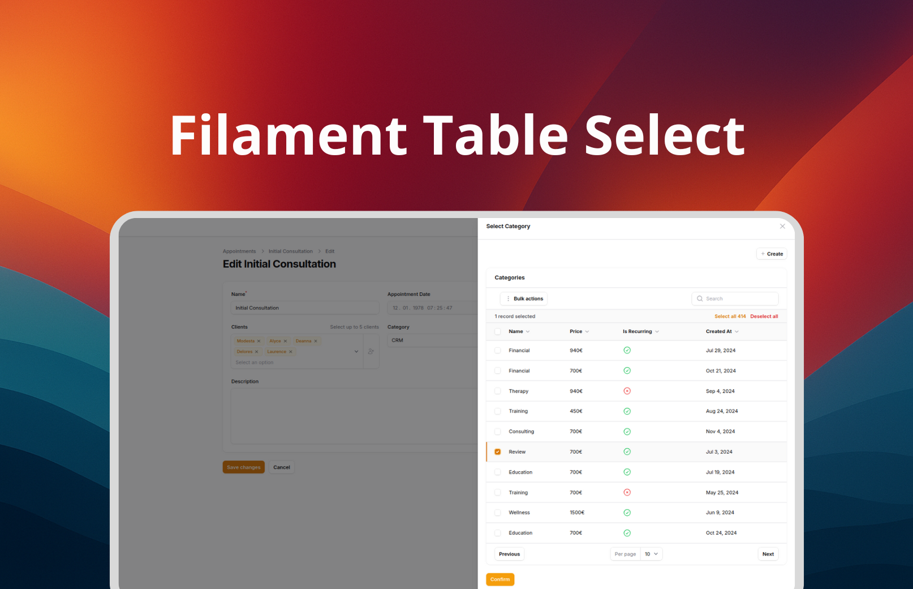

# Filament Table Select



> [!CAUTION]
> This package is still under development.

***
## Installation

```bash
composer require dvarilek/filament-table-select
```

***
## Overview

This package enhances the Filament Select Form component by adding an option to select related records
from a full-fledged Filament table using a suffix action.

This component — Table Select — is an extension of Filament's Select component. All functionalities and methods of the 
original Select component are still available. Users can still choose to operate the component like a standard 
select by selecting from a simple dropdown.

What makes this component stand out is its selection suffix action. When clicked, this action opens a modal containing
a Selection Table. This table can be used to select related records with more context and clarity.
Users can interact with this table like any other Filament table — they can search, filter, group, and more — whatever 
it takes to select the record they are looking for.


https://github.com/user-attachments/assets/bba43a19-0536-438a-a83c-6687c080f215

***
## Getting Started

No configuration is required! Simply include the component in your form schema and define the relationship:

```php
use Dvarilek\FilamentTableSelect\Components\View\TableSelect;

$form
    ->schema([
        TableSelect::make('clients')
            ->relationship('clients', 'name')
    ])
```

<br>

***
## Configuring the Selection Table

You can configure the Selection table by passing a closure into the 'modifySelectionTable' method, this is where 
you can add columns, remove actions, modify the table's query etc.
```php
use Dvarilek\FilamentTableSelect\Components\View\TableSelect;
use Filament\Tables\Table;

TableSelect::make('clients')
    ->relationship('clients', 'name')
    ->modifySelectionTable(function (Table $table) {
        return $table
            ->heading('Select Active Clients') 
            ->actions([]) 
            ->modifyQueryUsing(fn (Builder $query) => $query->where('status', 'active'));
    })
```

Additionally, If you wish to customize the Selection Table Livewire component, you can access it as the second argument:
```php
use Dvarilek\FilamentTableSelect\Components\Livewire\SelectionTable;
use Filament\Tables\Table;

->modifySelectionTable(function (Table $table, SelectionTable $livewire) {
    // ...
})
```
<br>

To use an already defined table from a Filament Resource, use the 'tableLocation' method:
```php
use Dvarilek\FilamentTableSelect\Components\View\TableSelect;

TableSelect::make('clients')
    ->relationship('clients', 'name')
    ->tableLocation(ClientResource::class)
```

<br>

The Selection Table supports both single selection and multiple selection mode. Multiple selection mode allows you to 
select multiple records. While Single selection mode acts similarly to a radio for better selection experience.
This mode is determined by the result of 'multiple' method: 
```php
use Dvarilek\FilamentTableSelect\Components\View\TableSelect;

// multiple selection mode
TableSelect::make('clients')
    ->relationship('clients', 'name')
    ->multiple(),

// single selection mode
TableSelect::make('category_id')
    ->relationship('category', 'name')
    ->multiple(false)
```

### Multiple Selection

https://github.com/user-attachments/assets/5c035dca-fb22-47fa-9211-f9b92e275422


<br>

### Single Selection

https://github.com/user-attachments/assets/ecd41cf5-1796-472d-9abf-92a0c07568fc


<br>

To limit how many items the user can select in the Selection Table, use 'optionsLimit' method:
```php
use Dvarilek\FilamentTableSelect\Components\View\TableSelect;

// Only three records can be selected in total - the rest gets disabled for selection
TableSelect::make('clients')
    ->relationship('clients', 'name')
    ->multiple()
    ->optionsLimit(3),
```

> [!NOTE]
> If 'optionLimit' is set to 1, single selection mode gets activated regardless.

<br>

***
## Selection Action
The selection action and its modal where the table is contained can be configured using the 'modifySelectionAction' method:
```php
use Dvarilek\FilamentTableSelect\Components\View\TableSelect;
use Filament\Forms\Components\Actions\Action;

TableSelect::make('clients')
    ->relationship('clients', 'name')
    ->modifySelectionAction(function (Action $action) {
        return $action
            ->icon('heroicon-o-user-plus') 
            ->modalHeading('Select Clients') 
            ->slideOver(false);
    })
```

***
## Confirmation action

By default, the component's state is automatically updated as records are selected.
To require a confirmation of the selection, use the 'requiresSelectionConfirmation' method:
```php
use Dvarilek\FilamentTableSelect\Components\View\TableSelect;

TableSelect::make('clients')
    ->relationship('clients', 'name')
    ->requiresSelectionConfirmation();
```

This prevents automatic state updates and adds a confirmation action to the modal. Only when this action is clicked will 
the form component's state get updated.

https://github.com/user-attachments/assets/18fa9ae4-9f54-4142-93d9-83cae9dee74f

<br>

After confirmation, the modal closes by default. To keep it open, use the 'shouldCloseOnSelection':
```php
use Dvarilek\FilamentTableSelect\Components\View\TableSelect;

TableSelect::make('clients')
    ->relationship('clients', 'name')
    ->requiresSelectionConfirmation()
    ->shouldCloseOnSelection(false);
```

Or provide an optional parameter directly in the 'requiresSelectionConfirmation' method:
```php
    ->requiresSelectionConfirmation(shouldCloseOnSelection: false)
```
<br>

By default, the confirmation action is positioned in the bottom left corner of the modal. To change its position use the
'confirmationActionPosition' method:
```php
use Dvarilek\FilamentTableSelect\Components\View\TableSelect;
use Dvarilek\FilamentTableSelect\Enums\SelectionModalActionPosition;

TableSelect::make('clients')
    ->relationship('clients', 'name')
    ->requiresSelectionConfirmation() 
    ->confirmationActionPosition(SelectionModalActionPosition::TOP_LEFT);
```
Or provide an optional parameter directly in the 'requiresSelectionConfirmation' method:
```php
    ->requiresSelectionConfirmation(confirmationActionPosition: SelectionModalActionPosition::TOP_LEFT)
```

<br>

***
## Creating New Records

In a standard Select component, if users can’t find the record they need, they can create and associate a 
new one on using the 'createOptionAction'. - [Official Filament Documentation](https://filamentphp.com/docs/3.x/forms/fields/select#creating-a-new-option-in-a-modal)

```php
use Dvarilek\FilamentTableSelect\Components\View\TableSelect;

TableSelect::make('clients')
    ->relationship('clients', 'name')
    ->createOptionForm([
        // Configure Form schema...
    ])
    ->createOptionUsing(function (array $data) {
        // Create related record using...
    })
    ->createOptionAction(function () {
        // Configure the action...
    })
```

If defined, this Create Option Action can be included inside the Selection modal for a seamless user experience using the
'hasCreateOptionActionInSelectionModal' method:

```php
use Dvarilek\FilamentTableSelect\Components\View\TableSelect;
use Filament\Forms\Form;

TableSelect::make('clients')
    ->relationship('clients', 'name')
    ->createOptionForm(fn (Form $form) => ClientResource::form($form))
    ->hasCreateOptionActionInSelectionModal()
```

https://github.com/user-attachments/assets/1a2cdfde-828f-48d4-afc2-1b361fa98ea8


> [!IMPORTANT]
> When a new record is created, it's automatically selected in the table. If this newly created
> record exceeds the selection limit, the record naturally won't be selected. However, in single-selection
> mode, the new record will replace the old one.

> [!NOTE]
> The displayed action is a direct clone of the original create option action.

<br>

To avoid confusion, the original suffix create option action is hidden when using the action in Selection modal.
To display both actions, use the 'createOptionActionOnlyVisibleInSelectionModal' method.

```php
use Dvarilek\FilamentTableSelect\Components\View\TableSelect;
use Filament\Forms\Form;

TableSelect::make('clients')
    ->relationship('clients', 'name')
    ->createOptionForm(fn (Form $form) => ClientResource::form($form))
    ->hasCreateOptionActionInSelectionModal()
    ->createOptionActionOnlyVisibleInSelectionModal(false)
```

The action will now get displayed in the form component and the Selection modal.

Or provide an optional parameter directly in the 'hasCreateOptionActionInSelectionModal' method:
```php
    ->hasCreateOptionActionInSelectionModal(createOptionActionOnlyVisibleInSelectionModal: false)
```

<br>

By default, the create option action is positioned in the top right corner of the modal. To change its position use the
'selectionModalCreateOptionActionPosition' method:

```php
use Dvarilek\FilamentTableSelect\Components\View\TableSelect;
use Dvarilek\FilamentTableSelect\Enums\SelectionModalActionPosition;
use Filament\Forms\Form;

TableSelect::make('clients')
    ->relationship('clients', 'name')
    ->createOptionForm(fn (Form $form) => ClientResource::form($form))
    ->hasCreateOptionActionInSelectionModal()
    ->selectionModalCreateOptionActionPosition(SelectionModalActionPosition::TOP_LEFT)
```

Or provide an optional parameter directly in the 'hasCreateOptionActionInSelectionModal' method:
```php
    ->hasCreateOptionActionInSelectionModal(selectionModalCreateOptionActionPosition: SelectionModalActionPosition::TOP_LEFT)
```

<br>

To customize only the modal's create action without affecting the original create option action, use 
'modifySelectionModalCreateOptionAction' method:
```php
use Dvarilek\FilamentTableSelect\Components\View\TableSelect;
use Filament\Forms\Form;
use Filament\Forms\Components\Actions\Action;

TableSelect::make('clients')
    ->relationship('clients', 'name')
    ->createOptionForm(fn (Form $form) => ClientResource::form($form))
    ->hasCreateOptionActionInSelectionModal()
    ->createOptionActionOnlyVisibleInSelectionModal(false)
    ->modifySelectionModalCreateOptionAction(function (Action $action) {
        return $action->label('Add New Client');
    })
```

***

## Testing

```bash
composer test && composer stan
```
***

## Changelog
Please refer to [Package Releases](https://github.com/dvarilek/table-select/releases) for more information about changes.

***
## License
This package is under the MIT License. Please refer to [License File](LICENSE.md) for more information
